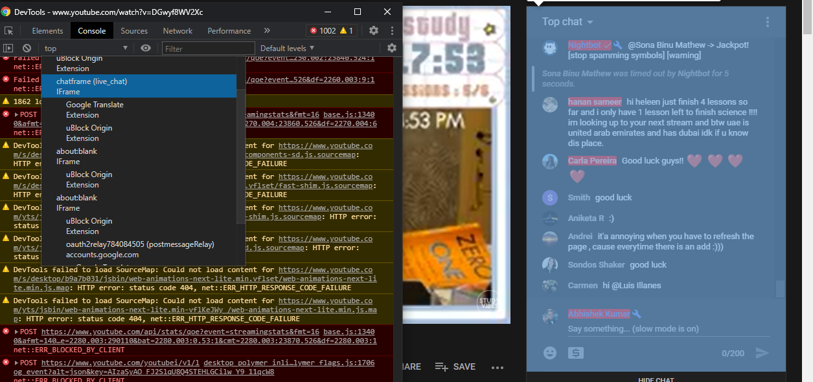

# Highlight YouTube Livechat Messages by Name

`highlight-yt-chat` is a JavaScript script that lets you highlight chat messages from people with the given name.

## Usage

Go to a YouTube livestream or a past stream where the chat is enabled. Wait for the page to load completely, and then open up the developer's tools of your web browser (in Chrome this can be done by pressing the `F12` button). After that you need to make sure that the livechat's iframe is selected. On Chrome, just make sure that you select the right iframe from the context selector:

Once done, you need to copy-and-paste the code from the included `hg.js` file into the same console window.

Now, you're ready to start highlighting user's messages. To highlight all messages from `["ABC", "Bot Dude", "Flower Girl", "XYZ"]`, type in the following and press Enter:

`hg(["ABC", "Bot", "Flower Girl", "XYZ"]);`
